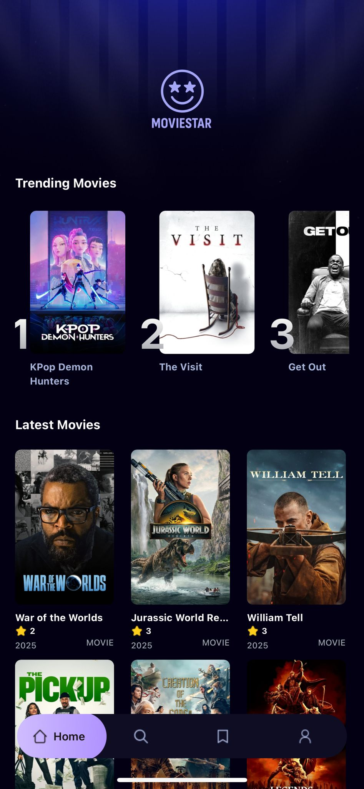
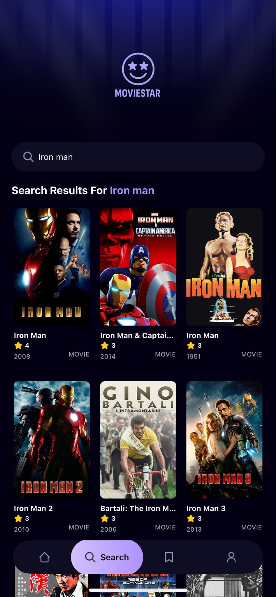

# 🎬 Movie Star

**Movie Star** היא אפליקציית מובייל שנבנתה ב־React Native עם Expo ו-TypeScript, ומעוצבת באמצעות Tailwind CSS.  
האפליקציה מציגה סרטים פופולריים בעיצוב מודרני ומבוססת על נתונים חיים מ־[TMDB API](https://www.themoviedb.org/documentation/api). 

[צפה בסרטון](https://www.youtube.com/shorts/m52OnAwSmeQ)

---

## 🚀 תכונות עיקריות

- 🔥 **Trending Movies** – סרטים פופולריים לפי חיפושי משתמשים באפליקציה.
- 🎞️ **Latest Hot Movies** – הסרטים הלוהטים ביותר עכשיו מה-TMDB.
- 🔎 **מנוע חיפוש** – מאפשר למשתמשים לחפש סרטים לפי שם.
- 🧠 **למידת הרגלי שימוש** – כל חיפוש משפיע על רשימת ה־Trending.
- ☁️ **שירות צד שרת באמצעות Appwrite** – לניהול מסד נתונים, אחסון וחיבור מאובטח.
- 👤 **ניהול משתמשים מלא** – רישום, התחברות ופרופיל אישי.
- 💾 **שמירת נתוני משתמשים והסרטים שאהבו** – נתונים נשמרים בטבלת SQL בחסות Supabase.
- 🔒 **אבטחה עם JWT Token** – גישה מוגנת ל־API ומידע רגיש.

---

## 🖼️ תצוגות מסך

  
  
  
  
  

## 🧱 טכנולוגיות בשימוש

| טכנולוגיה       | תיאור |
|------------------|--------|
| **React Native** | לפיתוח חוצה פלטפורמות |
| **Expo**         | לבנייה והרצה מהירה |
| **TypeScript**   | הקלדה סטטית ובטיחות בקוד |
| **Tailwind CSS** | עיצוב יעיל ומהיר עם Utility Classes |
| **TMDB API**     | מקור הסרטים |
| **Appwrite**     | Backend לניהול מסד נתונים וחיפושים |
| **Supabase**     | לאחסון נתוני המשתמשים |

